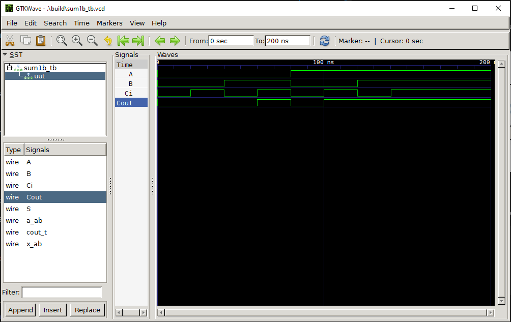

## Sumador de 1 bit


### **Integrantes**:

* Henry Martinez
* Santiago Silva
* Julian Rojas

### **1. Para que sirve**:
----------------------------------------------------------------

El sumador de 1 bit tiene dos entradas principales, normalmente denominadas 
𝐴
A y 
𝐵
B, y una entrada adicional llamada "acarreo de entrada" (
𝐶
𝑖
𝑛
C 
in
​
 ). Produce dos salidas:

Suma (S): Es el resultado de sumar los bits de entrada 
𝐴
A y 
𝐵
B, junto con el acarreo de entrada 
𝐶
𝑖
𝑛
C 
in
​
 .
Acarreo de salida (C_{out}): Es el acarreo generado por la suma, que se utiliza para la siguiente etapa en un sumador de múltiples bits.


### **Definición del módulo**:

Aquí se define el módulo ```sum1b``` con tres entradas ```(A, B, Ci)``` y dos salidas ```(Cout y Sum)```:

```
module sum1b(
        input A, 
        input B, 
        input Ci,
        output Cout,
        output Sum
    );
```
* A y B son los bits de entrada que se desean sumar.

* Ci es el acarreo de entrada (carry-in), que proviene de una etapa anterior en sumadores de múltiples bits.

* Sum es la suma del bit de los resultados.

* Cout es el acarreo de salida (carry-out), que se utilizará en la siguiente etapa si se está sumando más de un bit.

### **Registro de resultados**:

```
reg [1:0] result;
```

Aquí se declara un registro de 2 bits llamado ```result```. Este registro almacenará el resultado de la suma de los bits de entrada junto con el acarreo.

* result[0] almacena el bit de la suma (Sum).
* result[1] almacena el acarreo de salida (Cout).

### **Asignaciones de salida**:

Estas dos líneas de código asignan los valores del registro result a las salidas correspondientes del módulo:

```
assign Sum = result[0];
assign Cout = result[1];
```

* Sum se asigna al bit menos significativo (result[0]).
* Cout se asigna al bit más significativo (result[1]).

### **Bloque always**:

```
always@(*) begin
  result = A + B + Ci;
end

```
  Se ejecuta cada vez que cualquiera de las entradas (A, B, o Ci) cambien de valor. La operación A + B + Ci se realiza dentro de este bloque, y el resultado se almacena en el registro result.

* La operación A + B + Ci suma los bits A y B junto con el acarreo de entrada Ci.
* Como el registro result es de 2 bits, puede almacenar tanto el bit de suma (Sum) como el acarreo de salida (Cout).

### **Simulacion GTKWave**:



Con la ayuda de la herramienta de simulacion GTK podemos ver el funcionamiento del programa antes de cargarlo a nuestra FPGA, una vez ejecutado podemos ver la señal de entrada A y B junto al Carry .

Variando entre los dos posibles estados de los Bit originales logramos tener todos los posibles resultados confirmando el resultado de la tabla de verdad.