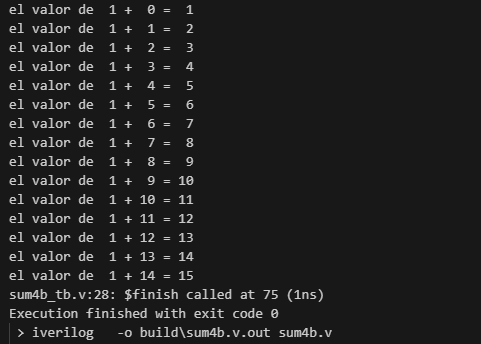
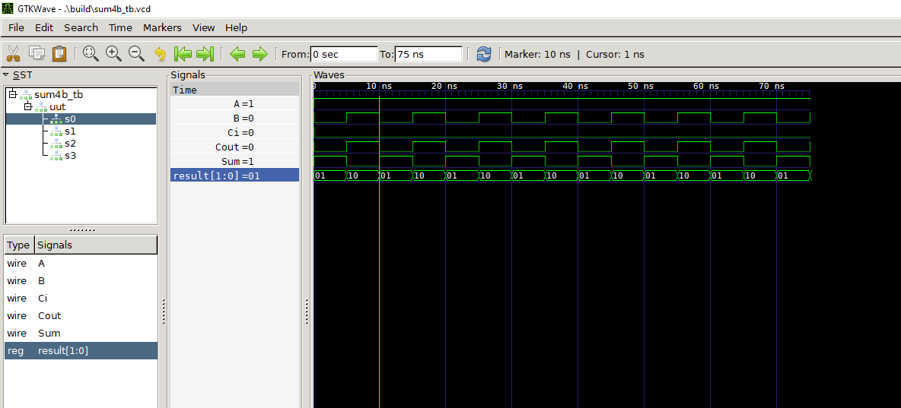

## Arquitectura de Procesadores
## Documentacion Sumador de 4 bits


### **1. Sumador 4 bits**
----------------------------------------------------------------


 

 El Sumador de 4 bits es un circuito digital que realiza la suma de dos numeros binarios de 4 bits, este sumador permite sumar dos numeros binarios de 4 y producir una suma de hasta 5 bits esto debido a un bit de acarreo.

El sumador de 4 bits se basa en cuatro sumadores completos de 1 bit conectados en casacada, cada sumador tiene tres entradas , dos bits que se van a sumar y una entrada de acareo y con dos salidas el bit de suma y el bit de acareo.


### 2.Explicacion Codigo Sumador 4 bits
---------------------------------------------------------------
1.Para poder empezar con nuestro sumador de 4 bits necesitamos inckuir el archivo de sumador de 1 bit ya que es requerido para asi lograr generar el sumador de 4 bits


```
`include "sum1b.v"
```
2.Teniendo nuestro sumador de 4 bits procedemos a definir nuestro modulo principal que sera el modulo de sumador de 4 bits asignandole  2 vectores de 4 bits , el primero A que representara el primer numero binario de entrada y el  segundo B sera el segundo numero binario de entrada. con un vector de 4 bit que representara la suma de los dos numeros binarios Sum.
```

module sum4b (
        input  [3:0] A, \\primer numero binario
        input  [3:0] B, \\segundo numero binario
        output    Cout, \\bit de salida (acarreo)
        output [3:0] Sum \\suma de los dos numeros binarios A y B
    );

```
3.Declaracion de las Señales Internas para propagar los acareos entre los sumadores de 1 bit
```
wire c1,c2,c3;
wire c_out; 
```
4.Instancias de Sumadores de 1 bit
```
  sum1b s0 (.A(A[0]), .B(B[0]), .Ci(1'b0),  .Cout(c1) ,.Sum(Sum[0]));
  sum1b s1 (.A(A[1]), .B(B[1]), .Ci(c1), .Cout(c2) ,.Sum(Sum[1]));
  sum1b s2 (.A(A[2]), .B(B[2]), .Ci(c2), .Cout(c3) ,.Sum(Sum[2]));
  sum1b s3 (.A(A[3]), .B(B[3]), .Ci(c3), .Cout(Cout) ,.Sum(Sum[3]));
```
*sum1b s0: Suma los bits menos significativos de A y B . No tiene acarreo de entrada ci = 0.

*sum1b s1: Suma los siguientes bits A[1] y B[1], con el acarreo de salida del sumador anterior (c1) como acarreo de entrada (Ci). La salida del acarreo (Cout) se conecta a c2, y la suma (Sum[1]) es el siguiente bit del resultado.

*sum1b s2: Suma los bits A[2] y B[2], con el acarreo de salida del sumador anterior (c2) como acarreo de entrada (Ci). La salida del acarreo (Cout) se conecta a c3, y la suma (Sum[2]) es el siguiente bit del resultado.

*sum1b s3: Suma los bits más significativos A[3] y B[3], con el acarreo de salida del sumador anterior (c3) como acarreo de entrada (Ci). La salida del acarreo (Cout) es el acarreo final del sumador de 4 bits, y la suma (Sum[3]) es el bit más significativo del resultado.

El sumador de 4 bits utiliza 4 instancias del modulo sum1b para poder lograr la suma de dos numeros de 4 bits creando una posicion especifica en los resultados de la suma generando que los acareos se pasen a traves de cada sumador generando el resultado final.

Resultado Sum4b_tb Test Bench:

### 3.Simulacion Sumador 4 bits
---------------------------------------------------
Generamos por terminal del visual la simulacion del sumador de 4 bits por GTKWAVE:
```
C:\Users\SantiagoPC\Documents\ARQUITECTURA_PROCESADORES\Arquitectura_Proce_Ecci\2_sum4b> gtkwave .\build\sum4b_tb.vcd
```

Simulacion:

Con la ayuda de la herramienta de simulacion GTKWave podemos ver el funcionamiento del programa antes de cargarlo a nuestra FPGA, una vez ejecutado podemos ver la señal de entrada A y B de nuestros 4 sumadores  junto al Carry .

