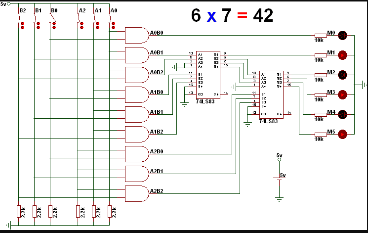

## Multiplicador 3 Bits


### **Integrantes**:

* Henry Martinez
* Santiago Silva
* Julian Rojas

### **1. Para que sirve**:
----------------------------------------------------------------


Un multiplicador de 3 bits es un circuito digital que multiplica dos números binarios de 3 bits de longitud. Su principal función es realizar la operación aritmética de multiplicación entre estos números binarios y generar un resultado que puede tener hasta 6 bits (ya que 3+3=6).


### **Aplicaciones de un multiplicador de 3 bits**:

* Procesamiento digital de señales: Se usa en aplicaciones como filtros digitales, procesamiento de imágenes y audio, donde se necesita realizar multiplicaciones rápidas y precisas.

* Controladores y microprocesadores: En microprocesadores, los multiplicadores son componentes fundamentales en las unidades aritméticas y lógicas (ALU) para realizar operaciones de multiplicación que son comunes en muchos cálculos.

* Sistemas embebidos: Se usan en aplicaciones embebidas para realizar cálculos aritméticos simples, como en controles industriales, dispositivos electrónicos de consumo y comunicaciones digitales.

* Algoritmos de procesamiento matemático: En algoritmos que requieren operaciones de multiplicación, como la transformación rápida de Fourier (FFT) o algoritmos criptográficos.

* Circuitos de control: En sistemas de control digital donde se necesita realizar multiplicaciones para ajustar señales o realizar cálculos proporcionales.

Salida: Un resultado de 6 bits que representa el producto de los dos números de entrada.

### **Descripción del módulo**:

### Entradas:

```clk:``` Señal de reloj.\
```init:``` Señal de inicio que arranca el proceso de multiplicación.\
```MR:``` Multiplicando, un número de 3 bits.\
```MD:``` Multiplicador, otro número de 3 bits.

```
module multiplicador(
        input clk,
        input init,    
        input [2:0] MR, 
		input [2:0] MD, 
        output reg done,
		output reg [5:0] pp
    );

    reg sh;
    reg rst;
    reg add;
    reg [5:0] A;
    reg [2:0] B;
    wire z;

    reg [2:0] status;

    // Estados de la FSM 
    parameter START = 0, CHECK = 1, ADD = 2, SHIFT = 3, END1 = 4;

    initial begin
        status = START;
        rst = 1'b0;
        pp = 6'b0;
        A = 6'b0;
        B = 3'b0; 
    end
```
### Salidas:

```done:``` Señal que indica cuándo la multiplicación ha terminado.\
```pp:``` Resultado de la multiplicación, que puede tener hasta 6 bits.

```
output reg done,
		output reg [5:0] pp
    ;
```

### Registros internos:

```A:``` Registro que almacena el valor del multiplicando alineado a la derecha con tres ceros adicionales a la izquierda (se usa para los productos parciales).\
```B:``` Registro que almacena el valor del multiplicador.\
```sh, rst, add:``` Señales de control para desplazamiento, reinicio, y suma respectivamente.\
```status:``` Estado actual de la FSM.\
```z:``` Señal que indica si el valor de B es cero.

### Máquina de Estados Finitos (FSM):

La FSM tiene los siguientes estados:

```START:``` Estado inicial que espera la señal de inicio (init). Si init está activa, se mueve al estado CHECK.

```CHECK:``` Comprueba si el bit menos significativo de B (el multiplicador) es 1. Si es 1, pasa al estado ADD, de lo contrario, pasa al estado SHIFT.

```ADD:``` Realiza la suma del acumulador pp con el registro A (el multiplicando alineado). Luego, pasa al estado SHIFT.

```SHIFT:``` Desplaza A hacia la izquierda y B hacia la derecha. Si B se convierte en 0, pasa al estado END1, de lo contrario, vuelve a CHECK.

```END1:``` Indica que la operación ha terminado y retorna al estado START.

```
CHECK: begin 
	        	done <= 1'b0;
	        	rst <= 1'b0;
	        	sh <= 1'b0;
	        	add <= 1'b0;
	        	status <= (B[0]==1)? ADD : SHIFT;

```

### Explicación de los bloques siempre (always):

FSM Control (always @(negedge clk)): Este bloque implementa la FSM que controla los pasos de la multiplicación secuencial:

* En el estado ```START```, espera la señal de inicio y luego se prepara para revisar los bits de B.
* En el estado ```CHECK```, revisa si debe sumar A al producto parcial (pp) basándose en el bit menos significativo de B.
* En ```ADD```, suma A a pp si corresponde.
* En ```SHIFT```, desplaza A a la izquierda y B a la derecha.
* En ```END1```, indica que la multiplicación ha finalizado.

### Registros de desplazamiento (always @(posedge clk)):
* Si ```rst``` está activa, inicializa A con el multiplicador (MD) alineado y B con el multiplicando (MR).
* Si ```sh``` está activa, realiza el desplazamiento: A a la izquierda y B a la derecha.

### Suma de productos parciales (always @(posedge clk)):

* Si ```rst``` está activa, resetea pp a cero.
* Si ```add``` está activa, suma A al producto parcial (pp)

### Comparador (assign z):

* Determina si B es cero para indicar la finalización de la multiplicación.

```

 // bloque comparador 
    assign z = (B==0)? 1'b1 : 1'b0;

//endmodule
```
fn.